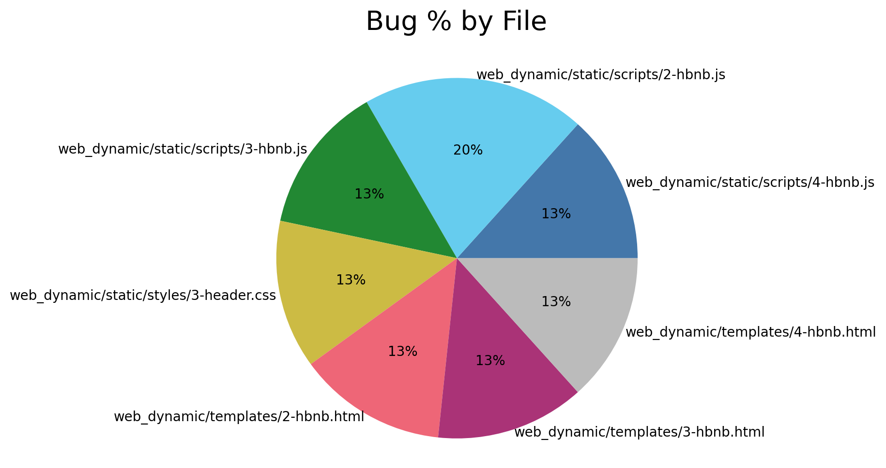

# dragonfly


## What does dragonfly do?

* dragonfly will scan a git repository and return a json file filled with certain commit data

* The file will contain a json dictionary with files as the keys

* Each file will have a number, which is the total number of commits that had the words "fix", "bug", or "issue"

* dragonfly will also return a png file, containing a visualization of the json data

## Installation

```shell
pip3 install git-dragonfly
```

## System Requirements

You need to have at least version 3.6 of Python to install and use this software

## How to use

```shell
$ dragonfly --help
usage: dragonfly ABSOLUTE_PATH_TO_REPO [BRANCH]

  Return commit data from given repository.

Options:
	--version   print version
	--help      print this message
	--terminal  print data in terminal
	--chart     generate pie chart of results
```

To scan a repository:

```shell
$ dragonfly ~/Absolute/path/to/repo
[----------------] Analysis Complete!
drgnfly_analysis.json file generated
$
$ ls
drgnfly_analysis.json
```

Want to scan a certain branch?

```shell
$ dragonfly ~/Absolute/path/to/repo [branch]
[-------------] Analysis Complete!
drgnfly_analysis.json file generated
$
$ ls
drgnfly_analysis.json

$
$ cat drgnfly_analysis.json
{"web_dynamic/static/scripts/4-hbnb.js": 2, "web_dynamic/static/scripts/2-hbnb.js": 3, "web_dynamic/static/scripts/3-hbnb.js": 2, "web_dynamic/static/styles/3-header.css": 2, "web_dynamic/templates/2-hbnb.html": 2, "web_dynamic/templates/3-hbnb.html": 2, "web_dynamic/templates/4-hbnb.html": 2}
$
```

## Options

To print the results of the analysis without generating a json file, type "--terminal" at the end

```shell
$ dragonfly ~/Absolute/path/to/repo [branch] --terminal
[-------------] Analysis Complete!
web_dynamic/static/scripts/2-hbnb.js   | 3
web_dynamic/static/scripts/4-hbnb.js   | 2
web_dynamic/static/scripts/3-hbnb.js   | 2
web_dynamic/static/styles/3-header.css | 2
web_dynamic/templates/2-hbnb.html      | 2
web_dynamic/templates/3-hbnb.html      | 2
web_dynamic/templates/4-hbnb.html      | 2
$
```

To generate a .png file containing a visual representation of the data, type "--chart" at the end

```shell
$ dragonfly ~/Absolute/path/to/repo [branch] --chart
[-------------] Analysis Complete!
heat_map1.png file generated
$
$ ls
heat_map1.png
```

Here is an example of the png file



NOTE: the numbers in each of the pie pieces are the percentages of commits that each file had with the keywords in their commit message. So "web_dynamic/static/scripts/2-hbnb.js" held 20% of all commits with the words 'bug', 'fix', or 'issue'.

## Authors

Maddi Laizure - [Github](https://github.com/mlaizure)

Corbin Vandeventer - [Github](https://github.com/forstupidityonly)

Finn Aspenson - [Github](https://github.com/faspen)
