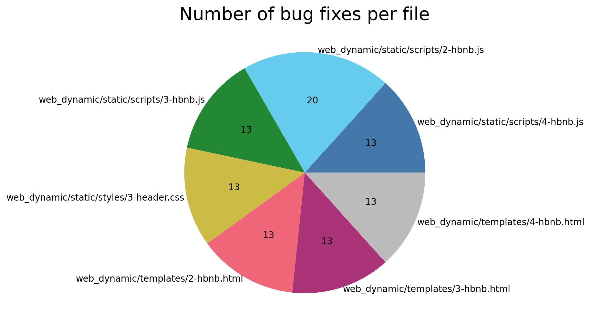

# dragonfly


## What does dragonfly do?

* dragonfly will scan a git repository and return a json file filled with certain commit data

* The file will contain a json dictionary with files as the keys

* Each file will have a number, which is the total number of commits that had the words "fix", "bug", or "issue"

* dragonfly will also return a png file, containing a visualization of the json data

## How to use

```shell
$ dragonfly --help
usage: dragonfly ABSOLUTE_PATH_TO_REPO [BRANCH]

  Return commit data from given repository.

Options:
	--version	print version
	--help     print this message
```

To scan a repository:

```shell
$ dragonfly ~/Absolute/path/to/repo
$
$ ls
drgnfly_analysis.json
```

Want to scan a certain branch?

```shell
$ dragonfly ~/Absolute/path/to/repo [branch]
$
$ ls
drgnfly_analysis.json  drgnfly_map.png

$
$ cat drgnfly_analysis.json
{"web_dynamic/static/scripts/4-hbnb.js": 2, "web_dynamic/static/scripts/2-hbnb.js": 3, "web_dynamic/static/scripts/3-hbnb.js": 2, "web_dynamic/static/styles/3-header.css": 2, "web_dynamic/templates/2-hbnb.html": 2, "web_dynamic/templates/3-hbnb.html": 2, "web_dynamic/templates/4-hbnb.html": 2}
$
```

Here is an example of the png file



## Authors

Maddi Laizure - [Github](https://github.com/mlaizure)

Corbin Vandeventer - [Github](https://github.com/forstupidityonly)

Finn Aspenson - [Github](https://github.com/faspen)
